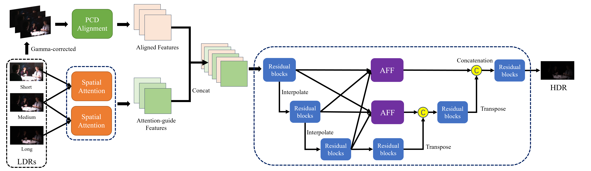

# AM-Unet: Attention-guided Multi-scale Approach for High Dynamic Range Imaging
By Jinjing Li, Chenghua Li, Fangya Li, Ruipeng Gang, Qian Zheng and Yuntian Cao

## Overview of the network
<div align="center">
  
</div>

## Getting Started

1. [Dataset](#dataset)
2. [Configuration](#configuration)
3. [How to test](#how-to-test)
4. [How to train](#how-to-train)
5. [Visualization](#visualization)

### Dataset
Register a codalab account and log in, then find the download link on this page:
```
https://competitions.codalab.org/competitions/28161#participate-get-data
```
#### It is strongly recommended to use the data provided by the competition organizer for training and testing, or you need at least a basic understanding of the competition data. Otherwise, you may not get the desired result.

### Configuration

```
pip install -r requirements.txt
```

### Compile DCNv2
```
cd codes/models/dcnv2
python setup.py build develop  # build in your conda virtual environment
```

### How to test for ntire2022 hdr track2
- download pretrained model
Google Drive: https://drive.google.com/file/d/1wRsc9HQFcbT7nEFS50cfL9N3bql9cuGV/view?usp=sharing

- put this model 210000_G.pth in './experiments/Delete_0307/models', then run: 

```
cd codes
python test.py -opt options/test/test_HDR.yml
```
The test results will be saved to `./results/<your result name>`.

### How to train

- Prepare the data. Modify `input_folder` and `save_folder` in `./scripts/extract_subimgs_single.py`, then run
```
cd scripts
python extract_subimgs_single.py
```

- Modify `dataroot_LQ` and `dataroot_GT` in `./codes/options/train/train_HDR.yml`, then run:

```
cd codes
python train.py -opt options/train/train_HDR.yml
```

The models and training states will be saved to `./experiments/name`.

## Calculate ops
- Because of storage limitations, we use (1, 6, 1060 // 4, 1900 // 4) as inputs. When submitting readme.txt, we use total_macs * 16 and mean_runtime * 16 as our result. You can try to set the scale=1 in calculate_ops_example.py if your GPU allowed.

- run: 
```
python calculate_ops_example.py
```

### Visualization

In `./scripts`, several scripts are available. `data_io.py` and `metrics.py` are provided by the competition organizer for reading/writing data and evaluation. Based on these codes, I provide a script for visualization by using the tone-mapping provided in `metrics.py`. Modify paths of the data in `./scripts/tonemapped_visualization.py` and run
```
cd scripts
python tonemapped_visualization.py
```
to visualize the images.

## Acknowledgment
The code is inspired by [HDRUNet](https://github.com/chxy95/HDRUNet).
